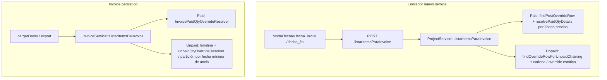

# Override Payment (paid / unpaid) y fecha del invoice — Flujo actual y verificación

Documento de referencia para el comportamiento **implementado** (alineado con `README.md` → sección Override Payment).

## 0. Implementación aplicada (código)

### 0.1 Elegir cabecera / fila de override (por `project_item` y mes del invoice)

Para cabeceras con **`invoice_override_payment.date` informada** (las nulas se ignoran en el picker):

1. Se normaliza **mes del invoice** = primer día del mes de `invoice.start_date`.
2. **Candidatas:** cabeceras cuyo mes cumple **`mes(cabecera) ≤ mes(invoice)`** (equivalente a **`mes(invoice) ≥ mes(cabecera)`**). Ej.: cabecera octubre → aplica a facturas de octubre en adelante; **no** a agosto/septiembre.
3. Entre candidatas, la fila ganadora es la de **fecha de cabecera más reciente** (desempate por id de línea si hiciera falta): `InvoiceItemOverridePaymentRepository::pickBestInvoiceItemOverrideByHeaderRule`.

Ese predicado de mes es **el mismo** en:

- `findLatestNullStartForInvoicePeriodAfterEndDate` (nombre histórico; admite `$invEnd` por firma; el filtro usa `invStart`).
- `findLatestOverrideWithHeaderOnOrBeforeInvoiceMonth`.

La **diferencia** no está en “qué cabecera gana” para un mismo `invStart`, sino en **qué campo se lee después** y **en qué flujo** se encadena:

| Camino | Repositorio / entrada | Campo efectivo | Uso principal |
|--------|------------------------|----------------|---------------|
| **Paid** | `InvoicePaidQtyOverrideResolver::selectOverrideRowForInvoicePeriod` → `findLatestNullStart…` | `paid_qty` de la línea; si null, cae en `invoice_item.paid_qty` | `getEffectivePaidQty`, agregados, Bond, `paidIncrementForHistorialTimeline` (cada `override_id` una sola vez en la serie) |
| **Unpaid (ancla)** | `findLatestOverrideWithHeaderOnOrBeforeInvoiceMonth` | `unpaid_qty` o último valor en `InvoiceItemOverridePaymentUnpaidQtyHistory` | `InvoiceUnpaidQtyOverrideResolver`, `ProjectService::findOverrideRowForUnpaidChaining`, cadena post-override |

### 0.2 Archivos y coherencia

- **Paid:** `InvoicePaidQtyOverrideResolver`, `ProjectService::findPostOverrideRowForInvoicePeriod` (misma consulta que el resolver para el borrador).
- **Listado nuevo invoice:** `ProjectService::ListarItemsParaInvoice` + `computeUnpaidChainingAfterOverride` / totales previos con `paidQtyOverrideResolver->resolvePaidQtyDetails`.
- **Invoice guardado y export:** `InvoiceService::CargarDatosInvoice` → `ListarItemsDeInvoice` (paid vía resolver; unpaid con orden de facturas del ítem, `findEarliestUnpaidOverrideHeaderDate` y ancla alineada al resolver de unpaid).

Todo lo que delega en `selectOverrideRowForInvoicePeriod` o en `findLatestNullStartForInvoicePeriodAfterEndDate` queda alineado: listar ítems para invoice, cargar datos, export, etc.

### 0.3 Flujo en diagrama (alto nivel)

### 0.4 Unpaid encadenado: mes de la cabecera vs meses posteriores

Regla **implementada** en `InvoiceService::ListarItemsDeInvoice` (timeline, fallback y coherencia con recálculos QBF) y en `ProjectService::computeUnpaidChainingAfterOverride` / `calcularUnpaidQuantityFromPreviusInvoice` (borrador y cadena). Idea de negocio: en el **mes del override**, el **unpaid del snapshot** no se “corrige” restando el **paid** de ese mismo período (se tratan como conceptos independientes para ese mes); en **meses siguientes** la cadena vuelve a usar la fórmula habitual con **paid efectivo**.

| Caso | Criterio (`isSameCalendarMonth(invoice.start, fecha cabecera override)`) | Comportamiento (resumen) |
|------|--------------------------------------------------------------------------|---------------------------|
| **Mes de la cabecera** | Sí | Unpaid **mostrado** en ese invoice = **snapshot** (`anchorUnpaidEffective`). El **carry** hacia el siguiente período: `max(0, snapshot + quantity − QBF)` **sin** restar `paid`. |
| **Primer invoice en mes estrictamente posterior** | No (y aún no hay carry previo en la cadena de override) | `unpaid = snapshot + quantity − QBF` **sin** restar paid (transición desde el mes de cabecera). |
| **Meses posteriores** (ya hay carry) | No | `unpaid = unpaid_anterior + quantity − paid_efectivo − QBF` (sí resta paid vía resolver / línea usada en cadena). |

**`ProjectService`** (nuevo invoice / cadena):

- `findInvoiceItemByProjectItemAndDate($projectItemId, $fechaCabecera)` localiza la línea `InvoiceItem` cuyo invoice cae en el **mismo mes** que la cabecera (para sumar `quantity`/`QBF` del invoice de ese mes al snapshot sin mezclar paid del override en ese tramo).
- Si no hay facturas “posteriores” a la cabecera pero sí invoice en el mes del override: `u = max(0, snapshotUnpaid + qty_invoice_mes − QBF)` sin restar paid de la fila override.
- En el bucle de facturas con `start_date` ≥ cabecera: si el invoice es del **mismo mes** que la cabecera del override, **`paidToSubtract = 0`**; si no, se usa la lógica habitual de `paid_line` (efectivo o almacenado según override_id).

Referencia de commits en el repo: *new invoice unpaid qty correcta*, *Invoices meses posteriores*.

### Depuración (trazas)

**Estado por defecto: desactivado.** No se escribe en log salvo que se descomenten cuerpos o llamadas.

| Mecanismo | Destino típico | Cómo activar |
|-----------|----------------|--------------|
| `InvoiceService::logOverrideInvoice` | `public/weblog.txt` vía `Base::writelogPublic` | Descomentar el cuerpo del método en `InvoiceService.php` |
| `ProjectService::logUnpaidQtyCalc`, `logCompletionPaidTrace` | `public/weblog.txt` | Descomentar el cuerpo de cada método (y la constante de completion si aplica) |
| `OverridePaymentWritelog::writelog` | `weblog.txt` relativo a CWD o `$path_logs` + archivo | Descomentar `use` y llamadas en `ProjectService`, repositorio, etc. |

`OverridePaymentWritelog` **no** usa `kernel.project_dir`; si `$path_logs` está vacío, el archivo puede acabar en el **directorio de trabajo** del PHP. Para rutas estables, preferir `writelogPublic` → **`public/weblog.txt`**.

---

## 1. Resumen del problema

- Un **Payment Override** se define con una **fecha de cabecera** (`InvoiceOverridePayment.date`, p. ej. 1 de octubre).
- **Comportamiento esperado:** las cantidades `paid_qty` / `unpaid_qty` **efectivas** que vienen del override solo deben usarse cuando el **invoice** es del **mismo período o posterior** a esa fecha (según la regla de negocio acordada: típicamente **misma fecha del mes o posterior**, o **start_date del invoice ≥ fecha de cabecera del override**).
- **No** debe aplicarse **retroactivamente:** facturas de **meses anteriores** (Agosto, Septiembre) deben seguir usando los valores **persistidos** en `invoice_item` (`paid_qty`, `unpaid_qty`), **no** el snapshot del override de Octubre.

## 2. Regla de negocio (única fuente de verdad)

Para **cada** `InvoiceItem` ligado a un `Invoice` con `start_date` / `end_date`:

1. Obtener **cabeceras de override** del proyecto / ítem (`invoice_override_payment` + `invoice_item_override_payment`).
2. **Comparar la fecha del invoice** (normalmente `start_date`, o el criterio que defina el producto) **con la fecha de cabecera del override** (`header.date`).
3. **Si** el invoice es **anterior** al período de aplicación del override → **no** usar filas de override; `effective paid` = `invoice_item.paid_qty` (y `unpaid` según cadena histórica **sin** forzar override).
4. **Si** el invoice es **igual o posterior al mes de la cabecera** (para **paid** / fila de período) → aplicar `InvoicePaidQtyOverrideResolver` con la regla de meses.
5. Para **unpaid** en cadena con override, además aplicar la distinción **mes de cabecera vs meses posteriores** (§0.4): en el mes del override no se resta paid al snapshot de ese tramo; después sí se encadena con paid efectivo.

> **Definición aplicada (paid / fila por invoice):** `mes(invoice.start) ≥ mes(header.date)`; entre varias cabeceras que cumplen, la de **fecha más reciente**. Así una cabecera de **octubre** no se usa como fila de override para facturas de **agosto o septiembre** (el criterio es el mes del período, no un mix confuso día a día frente a la cabecera).

## 3. Estado actual del código (puntos críticos)

### 3.1 Núcleo: resolución de paid efectivo

| Archivo | Responsabilidad |
|--------|------------------|
| `src/Service/Admin/InvoicePaidQtyOverrideResolver.php` | `resolvePaidQtyDetails()`, `selectOverrideRowForInvoicePeriod()`, `getEffectivePaidQty()`. |
| `src/Repository/InvoiceItemOverridePaymentRepository.php` | `findLatestNullStartForInvoicePeriodAfterEndDate()` — cabeceras con **`mes(invoice) ≥ mes(h.date)`**; entre ellas, la fecha de cabecera **más reciente**. `findLatestOverrideWithHeaderOnOrBeforeInvoiceMonth()` — unpaid/ancla: **`mes(h.date) ≤ mes(invoice)`**. |

### 3.2 Unpaid efectivo

| Archivo | Responsabilidad |
|--------|------------------|
| `src/Service/Admin/InvoiceUnpaidQtyOverrideResolver.php` | Ancla por `findLatestOverrideWithHeaderOnOrBeforeInvoiceMonth`; valor desde columna `unpaid_qty` o historial de notas; `findEarliestUnpaidOverrideHeaderDate` para particionar la línea de tiempo en `ListarItemsDeInvoice`. **No** es la misma semántica que “solo paid”: mismo **criterio de mes** para elegir cabecera, distinto **campo** y encadenado con otras facturas del ítem. |
| `src/Service/Admin/ProjectService.php` | `calcularUnpaidQuantityFromPreviusInvoice()`, `computeUnpaidChainingAfterOverride()`, `findInvoiceItemByProjectItemAndDate()`, `findOverrideRowForUnpaidChaining()`, `findPostOverrideRowForInvoicePeriod()` (este último solo paid / cortes de agregado), `previousInvoiceTotalsMergedForPeriod()` — listado de ítems para **nuevo** invoice. Cadena unpaid: §0.4 (`paidToSubtract = 0` en mes de cabecera). |

### 3.3 Listado de ítems para nuevo invoice (borrador)

| Ruta / método | Uso |
|---------------|-----|
| `POST project/listarItemsParaInvoice` | `ProjectController::listarItemsParaInvoice` → `ProjectService::ListarItemsParaInvoice($project_id, $fecha_inicial, $fecha_fin)`. |
| Frontend | `public/assets/metronic8/js/pages/invoices.js`, `modal-invoice.js` — envían `start_date` / `end_date` del período del invoice en edición. |

Debe cumplirse: los agregados con override usan **las fechas del borrador** (`fecha_inicial` / `fecha_fin`), no “la última override del proyecto” sin filtro de fecha.

### 3.4 Ver / editar invoice existente y exportación

| Método | Uso |
|--------|-----|
| `InvoiceController::cargarDatos` | `InvoiceService::CargarDatosInvoice($invoice_id)`. |
| `InvoiceService::ListarItemsDeInvoice` / construcción de ítems | Usa `paidQtyOverrideResolver->getEffectivePaidQty($invoiceItem)` y lógica de unpaid encadenada con `overrideStartDate` y **mismo mes vs posteriores** (§0.4); recálculos QBF alineados. |
| `InvoiceService` (export Excel/PDF) | Misma fuente de datos que vista cuando usa `ObtenerDatosExportacionInvoice` / `getEffectivePaidQty` donde aplique. |

Cualquier pantalla que muestre **paid/unpaid** con “effective” debe respetar la **fecha del invoice guardado**, no la fecha “hoy” ni solo el proyecto.

### 3.5 Otros consumidores

| Área | Notas |
|------|--------|
| `ProjectService::computePreviousInvoiceTotalsForProjectItem` | Itera líneas de factura y usa `resolvePaidQtyDetails` por línea; la fecha de cada línea viene del `Invoice` asociado. |
| `InvoicePaidQtyOverrideResolver::sumEffectiveBondPaidQtyForProjectBeforeOrOnDate` | Bond acumulado hasta fecha — revisar coherencia con el corte por override. |
| `PaymentService` | Persistencia de `paid_qty`/`unpaid_qty` y notas; no siempre pasa por el resolver; validar que no se **sobrescriban** facturas viejas al guardar pagos. |

## 4. Mejoras futuras y checklist

### 4.1 Criterio “¿aplica override?”

- El criterio por **mes** está centralizado en el repositorio (`pickBestInvoiceItemOverrideByHeaderRule`). Opcional: exponer un helper de dominio explícito (`shouldHeaderApplyToInvoiceMonth`) para documentación y tests.
- Revisar otros puntos del código que aún usen reglas distintas (p. ej. solapamiento de rangos, `invoiceOverlapsOverrideRange`) y alinearlos o documentar la excepción.

### 4.2 Casos borde

- [ ] Invoice cuyo **rango** cruza meses (p. ej. inicio septiembre, fin octubre): la selección usa **`start_date`** del invoice para el mes; validar expectativa de negocio si el rango es atípico.
- [ ] **Varias** cabeceras: prioridad = cabecera **más reciente** entre las que cumplen el mes.
- [ ] **Mismo mes** que la cabecera: aplica (inclusive).

### 4.3 Datos

- En negocio, la cabecera lleva **`date` informada**; cabeceras sin fecha no entran en el picker actual.

### 4.4 Frontend

- El backend es la fuente de verdad; el JS debe enviar **`fecha_inicial` / `fecha_fin`** coherentes con el período del invoice (p. ej. `public/assets/metronic8/js/pages/invoices.js`, `modal-invoice.js`).

## 5. Plan de pruebas manuales (validación end-to-end)

Preparar un proyecto con:

- 3 invoices: **Agosto**, **Septiembre**, **Octubre** (fechas de inicio/fin coherentes).
- Un **override** con cabecera **1 de octubre** y `paid_qty` distintivo (p. ej. 150).

### 5.1 Nuevo invoice

1. Crear factura con período **Octubre** → debe reflejar override en **listarItemsParaInvoice** (totales / paid / unpaid coherentes).
2. Intentar crear factura **Septiembre** (nueva o borrador) → **no** debe mostrar valores como si el override de Octubre ya hubiera aplicado a ese período.

### 5.2 Invoices existentes

1. Abrir **Octubre** (`invoice/cargarDatos` o pantalla de edición) → paid/unpaid efectivos **con** override si corresponde.
2. Abrir **Septiembre** y **Agosto** → **solo** valores persistidos en BD; **no** el snapshot 150 del override de Octubre.

### 5.3 Export

1. Exportar Excel/PDF de **Septiembre** y **Octubre** y comparar columnas paid/unpaid con la pantalla en vivo.

### 5.4 Regresión: Bond

1. Si el proyecto usa Bond, repetir un caso con ítem Bond y sumas de `bon_quantity` / paid efectivo.

### 5.5 Regresión: Payments

1. Registrar un pago que toque `invoice_item` y **no** alterar facturas anteriores al override.

### 5.6 Unpaid: mes de cabecera vs mes siguiente (§0.4)

1. Con override en **octubre** y snapshot de unpaid conocido: abrir invoice de **octubre** → el unpaid mostrado debe ser el **snapshot**; el arrastre interno hacia noviembre debe reflejar `snapshot + qty_oct − QBF` **sin** restar paid de octubre en ese tramo.
2. Abrir invoice de **noviembre** (y siguientes) → unpaid debe encadenar con **`+ qty − paid_efectivo − QBF`** respecto al carry anterior.
3. Repetir **listarItemsParaInvoice** para un borrador en noviembre y comprobar coherencia con `computeUnpaidChainingAfterOverride` (mismo mes que cabecera → no restar paid en ese paso de cadena).

## 6. Seguimiento recomendado

1. Tests unitarios o de integración sobre `resolvePaidQtyDetails` con matrices invoice vs cabecera (opcional).
2. Ejecutar el plan de pruebas manuales de la sección 5 tras cada cambio en override o invoices.

## 7. Referencias rápidas en el repo

- Rutas: `src/Routes/Admin/project.yaml` (`listarItemsParaInvoice`), rutas de `invoice` para `cargarDatos` y export.
- Documentación relacionada: `README_BOND_CALCULATION.md` (Bond y fechas antes/después).

---

*Documento de referencia: override hacia adelante por mes, cadena de **unpaid** con distinción **mes de cabecera / meses posteriores** (§0.4), creación de invoice, visualización, export y lecturas efectivas de `paid_qty` / `unpaid_qty`.*
